# 发布规范

## 整体流程示意图

## 提交发布任务

### 请求形式

发布任务需要在`Jira`=>`项目发布看板`上新建发布任务，添加并完善**请求内容**，确认后把任务指派给相应的运维人员。

::: warning 参与人员：产品、测试、开发
 
:::

### 请求内容

产品和**开发/测试**确定：发布范围和测试结果（**测试环境结果决定是否可以发布**）。

1. **发布范围**：
   - 代码/分支确认；
   - 数据库（描述文字以及脚本附件）；
   - 影响业务清单（在测试环境上就需清楚，并在测试时追踪并更新）；
2. **测试描述**：
   - 发布内容清单：修复问题，新增特性；
   - 可接受问题清单；
   - 发布后**测试范围**和**测试方案**
3. **发布步骤**：具体的前后端发布流程明细；

> Tip：发布任务示例说明[文档](release-pr.md)。

::: warning 参与人员：测试手机信息进行填写
 
:::

## 发布审核

::: warning 参与人员：运维；辅助人员：产品、技术负责人（必要情况：发布失败）
 
:::

### 审核任务

接到发布任务，验证请求内容是否正确，如果不正确不予发布，并将任务返回给请求人。

1. 请求所需信息是否完整；
2. 确定发布时间/发布规则；
3. 发布结果确认时间/发布错误回退方案；

### 发布预生产环境

审核通过后按照发布请求**发布步骤**进行发布，发布后将任务指派给相应的测试人员。

**如果在发布过程中很多问题，可指回任务，让修改梳理后重新提交发布申请。**

## 预生产测试

::: warning 参与人员：测试；辅助人员：开发；
 
:::

测试人员按预定的**测试范围**和**测试方案**进行确认，返回发布测试结果。

### 测试成功

返回结果给运维进行预生产到生产的发布。

### 测试失败

根据**发布预期**决策进行处理。

## 发布结果与记录

::: warning 参与人员：产品、测试；
 
:::

- 发布成功：发布成功日志并邮件通知；
- 发布失败：发布失败日志和处理细节；

## 常见问题

### 运维怎么确定发布信息是否正确？

运维只能确定提供信息是否完整，是否正确应由提供方自己确认是否正确。
