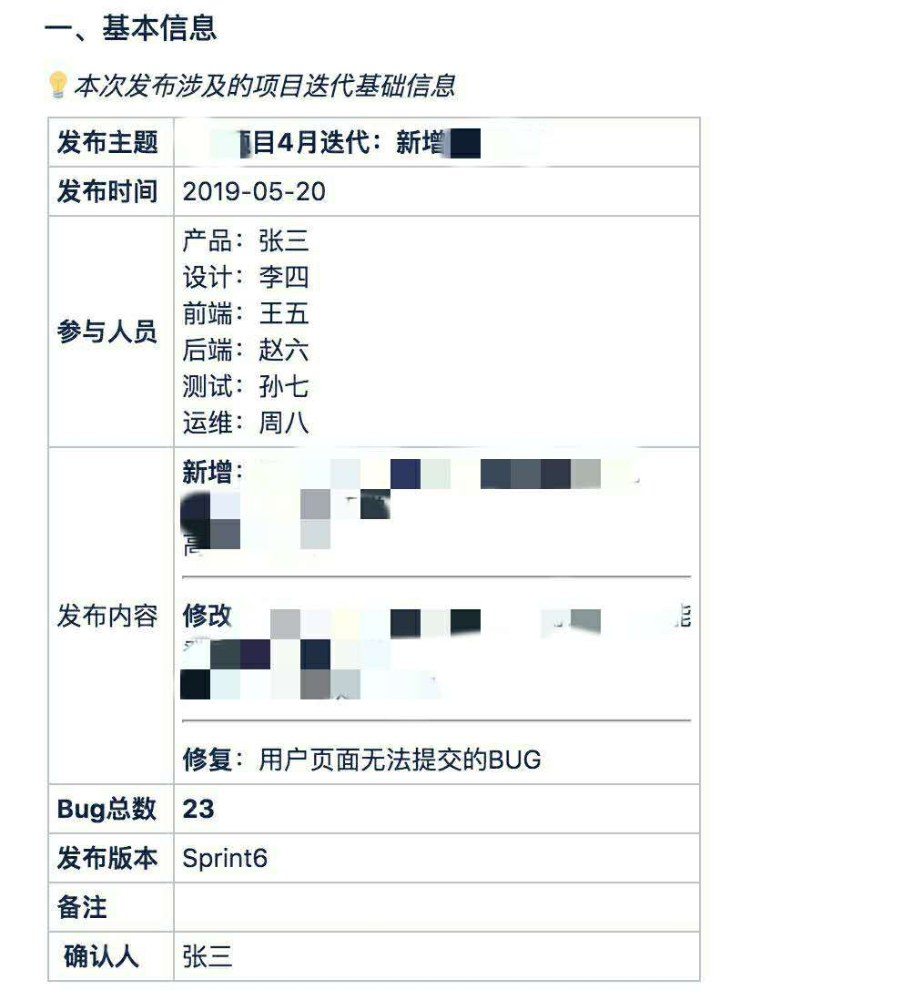
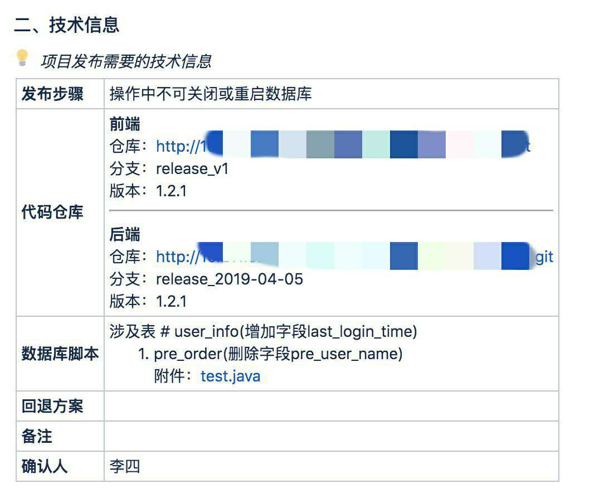

# 发布请求任务说明

## 发布整体流程

参考[发布流程规范](./release-flow.md)

## 任务基本信息



### 发布主题 <Badge text="必填" type="error"/>

::: tip 简要描述本次发布内容
- 说明是哪个项目
- 说明是哪个客户端
- 发布的主要功能
:::

例如：**c4i项目BI发布高二维功能**

### 发布时间 <Badge text="必填" type="error"/>

明确此次发布具体的操作时间，让运维可以安排好可操作时间。

```bash
格式：YYYY-MM-DD
示例：2019-06-01
```

::: tip
除紧急情况，请预留好配置与确认发布的时间，以免操之过急带来的不必要的操作失误。
:::

### 参与人员 <Badge text="必填" type="error"/>

必须包含以下角色：产品，设计，前端，后端，测试，运维。

::: warning
可在发布出问题时尽快联系相关人员解决。
:::

### Bug总数 <Badge text="必填" type="error"/>

本次发版所包含的特性和解决的问题总数，简明涵盖本次发版工作量（并不做其他评估参考）。

### 发布版本 <Badge text="必填" type="error"/>

按照正常的项目开发流程，这里应该填写具体的系统版本号或对应的`Sprint` 值。具体版本号，应在前后端代码信息中具体说明。

::: tip
运维可能需要根据此版本号修改数据库数据。
:::

例如：`Sprint01` 或 `v1.2.0`

### 确认人 <Badge text="必填" type="error"/>

**基本信息确认人**。可能信息所有人和信息填写人不一致，需要记录信息具体来源。

## 任务技术信息




### 发布步骤 <Badge text="选填" type="warning"/>

说明具体的发布步骤，或重点说需要注意重点发布步骤。**可能需要根据前后端分别说明。**

例如：在发布版本后注意更新数据库 `sys_version` 表中对应的版本号 `app_version`字段，值为基本信息版本号。

### 代码仓库 <Badge text="必填" type="error"/>

按前后端分别说明：

- 代码仓库地址
- 需发布分支名
- 发布版本号

::: warning
分支信息需要测试确认后提交，以免发布分支不正确导致代码不一致。
:::

### 数据库脚本 <Badge text="必填" type="error"/>

- 备注关于此事发布的数据库变动信息，**需要很具体**；
- 附上确认后的数据库脚本文件，并说明具体的使用步骤；

::: danger
数据库操作非常敏感，此类目信息需要反复确认后填写
:::

### 回退方案 <Badge text="必填" type="error"/>

说明如果发布未成功的情况下，具体的处理方案和步骤。可能有不同情况，例如：

- 主要功能发布成功，部分细节有问题但不影响主业务；
- 新功能不能使用，但是修复的BUG正常上线；
- 发布失败；

可按项目实际情况和历史处理方法，列举出处理方案。

### 确认人 <Badge text="必填" type="error"/>

**技术信息确认人**，需要项目相关的技术负责人角色确认，因为此处信息需要专业的评估和技术进行处理。
